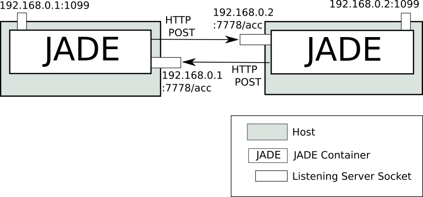
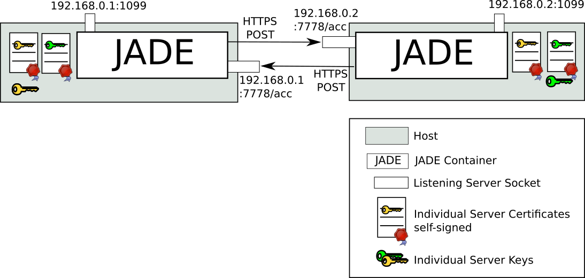
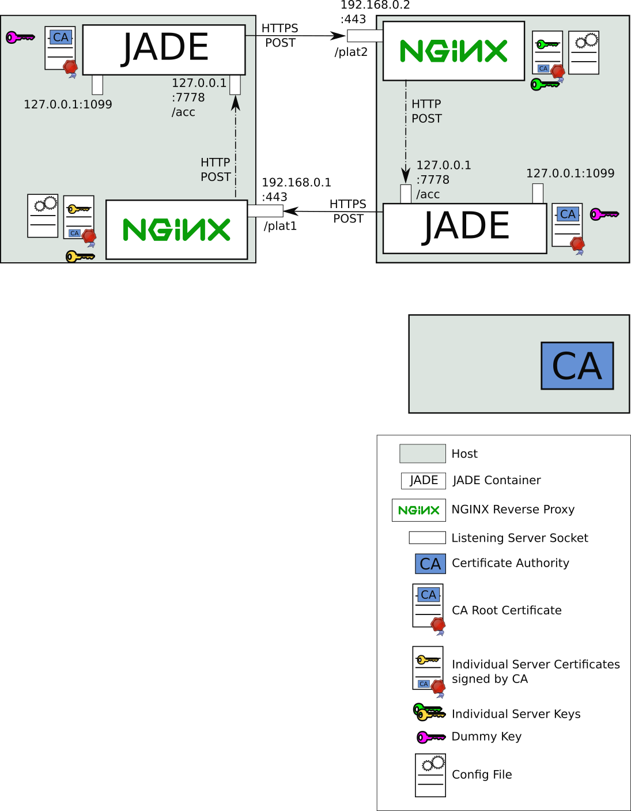
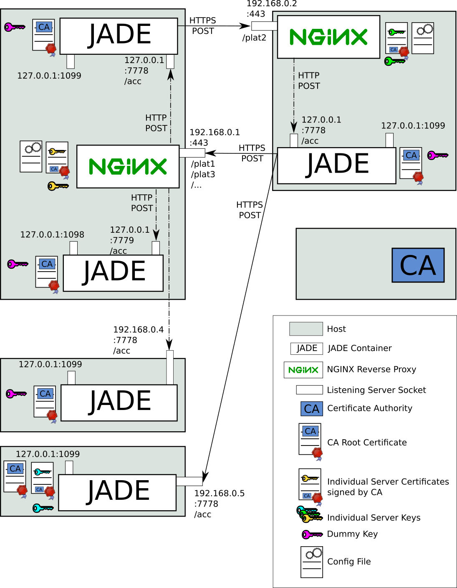

# JADE proxied HTTPS MTP

## What is this?
For us ([DAWIS chair at University Duisburg-Essen, Germany](https://www.dawis.wiwi.uni-due.de/forschung/energie-agenten/)) the necessity arose to "harden" the communiction of a cluster of JADE containers. We looked around the resources in the web and printed and applied the suggested things, but weren't quite satisfied yet. So we thought of a way to enforce some things by using a well-known and thoroughly tested HTTPS reverse proxy. It wasn't possible with the raw JADE distribution, but we were able to develop a tiny extension to the HTTP-MTP to make it work. It needs to be used as MTP class and requires a couple of new command line parameters.
I provide it here, in case anyone has a similar requirement as we. Eventually, it might be even interesting for the [core project](http://jade.tilab.com/). More on the implementation below.
The repository contains the source code and a ready-to-deploy .jar file, also there is a ping-pong agent for testing.
The code is also [included in our AgentWorkbench](https://github.com/EnFlexIT/AgentWorkbench/blob/osgi-agent-gui/eclipseProjects/org.agentgui/bundles/org.agentgui.lib.jade/src/jade/mtp/http/ProxiedHTTPS.java).

## Why would one want to use it, what are the benefits?
- No cryptography in Java: Faster, more secure, no java KeyStores
- Open the receive port independently from JADE/Java: Seperation of concerns, use different Unix users
- Apply more parsing/filtering to the incoming bits before they hit Java [TCP, TLS, HTTP, HTTP method (only POST), HTTP path (/acc), etc.]: lower possibility of successful attacks
- Restart Messaging independently from application, e.g. easier for key/certificate distribution and rollovers
- Run NGinx or another reverse proxy (should e.g. also work with Apache): Use well-known and -tested software with short security fixing times
- Control which protocols and cipher suites are to be used: This is very complicated in plain Java
- Multiplex multiple JADE containers (and other HTTPS applications like websites) over one NGinx instance: Only one standard port (443) open, can forward even to separate remote machines
- Possibly use load balancing or redundancy failover

## What needs to be done in order for it to work?
- Install NGinx via your system's packet manager
- Configure NGinx (see [example configuration](doc/nginx.conf))
- Create key/certificate via OpenSSL commands (plenty of tutorials in the web)
- Add new ProxiedHTTPS MTP to classpath and start JADE with additional parameters (see [example start script](jade-proxied-plat1.sh), use http://keystore-explorer.org/ for the KeyStore/TrustStore configuration)
- For testing, clone the repo, add jade and commons-codec to the `example/lib` folder, then first start plat1 (on a machine with IP 192.168.0.1), then start plat2 (on a machine with IP 192.168.0.2). Or edit the .sh files to cater for diferent IPs/other settings.

## Other suggestions
Additionally it is advisable to not use one self-signed certificate per JADE container, but either
- if running on publicly available servers, use [Let's Encrypt](https://letsencrypt.org/), use Let's Encrypt's Root Certificate for the FriendList TrustStore
- if running in private perimeters, set up your own CA ([pretty easy tutorial](https://jamielinux.com/docs/openssl-certificate-authority/index.html)) and only use it's Root certificate for the FriendList TrustStore
This way you only have to setup one TrustStore once, which can easily be reused for all containers, even if new are added during runtime.

For additional hardening, we emphatically recommend binding the RMI port only to the loopback device via `-local-host` parameter. Also setting `-platform-id` will make things clearer.

## How does it work?
Here are a couple of images for better understanding, what the new MTP does:

The known plain HTTP way of communicating. Do NOT use in production!

The known simple HTTPS way, with 1:1 key exchange

The new way: Two containers, each behind a NGinx, using a CA

The new way in a complex case: Combine, mix and multiplex 5 containers on different machines with and without NGinx

1 and 2 are only to recap the usual way of doing it to see the contrast in 3. 4 is only to show off the capabilities.
The different platforms in image 4 are reflected in the different .sh files in [the example directory](example/).

## Details about the implementation
- Each JADE needs a TrustStore with the CA certificate for outgoing messages (to trust the opposite server, e.g. NGinx)
- Each JADE needs a dummy KeyStore with a Key/Certificate chain. This will not be used in any way but is only necessary to avoid NullPointerExceptions
- The NGinxes need to be configured with vaild cryptography
- The new ProxiedHTTPS MTP is configured solely via `jade_mtp_proxiedhttps_*` parameters. You cannot use the `-mtps jade.mtp.http.MessageTransportProtocol(https://localhost:7778/acc)` syntax with provided address! 
- The ProxiedHTTPS MTP works by redirecting the opening of the (private) listen socket to the local loopback device without JADE internals noticing it, but instead JADE uses the provided public values/address in it's outgoing messages as sender address. That way, any replying agent will send the message to NGinx, which will (due to it's configuration) forward the message to JADE's private loopback socket. Pretty simple principle.
- The SocketFactory is reconfigured afterwards to use HTTPS for outgoing messages.
- Unfortunately, it was necessary to use reflection, to reset the `_useSSL` field in the SocketFactory because there is no other way of doing it when starting in HTTPS and then stopping and starting a new container without shutting down the JVM.
- A couple of other specialities could be solved a little more elegant, if the JADE internal API was changed slightly (adding a return value and changing fields/methods from private to protected)

## Disclaimer
All code is under LGPL like JADE itself, there is no warranty.
Until now, we tested the ProxiedHTTPS MTP only internally, no real-life test as of yet. But since the changes are really small and everything runs smoothly in our tests, we are pretty confident that it is solid and can not be worse than the usual way. It has not been tested in combination with JADE's outbund settings yet (client auth, proxy, numKeepAlive, outPort etc.).

We are happy to hear from you in any form, if ProxiedHTTPS MTP is interesting or helpful to you.
